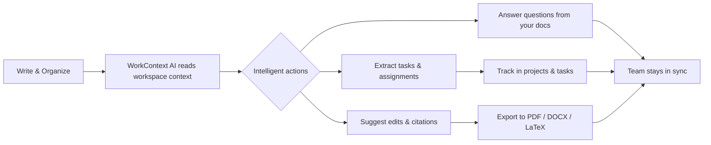
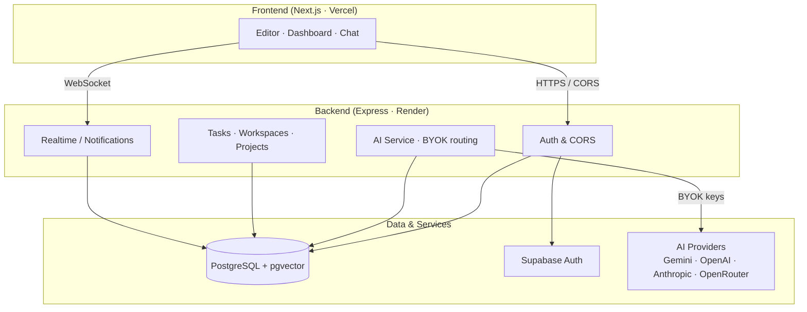
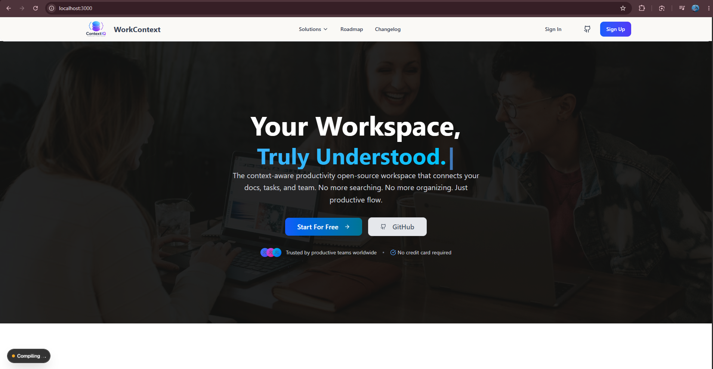
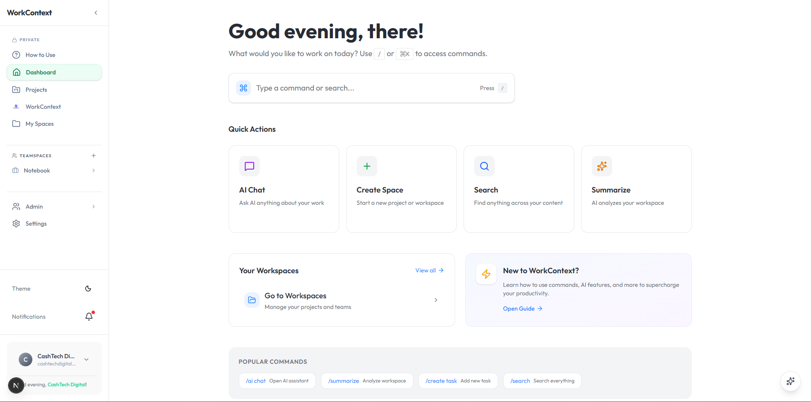
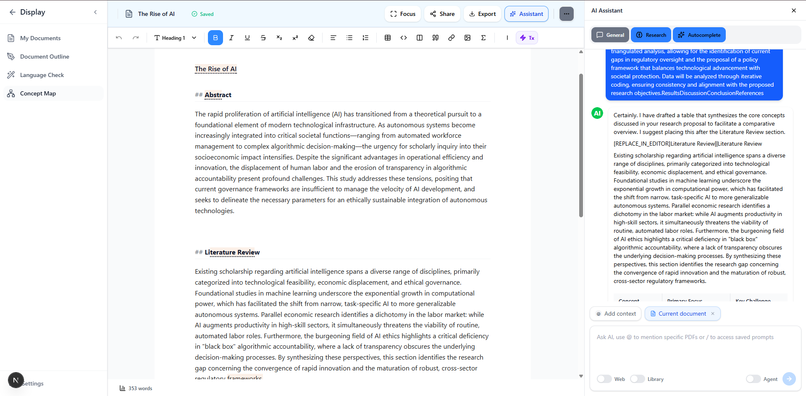
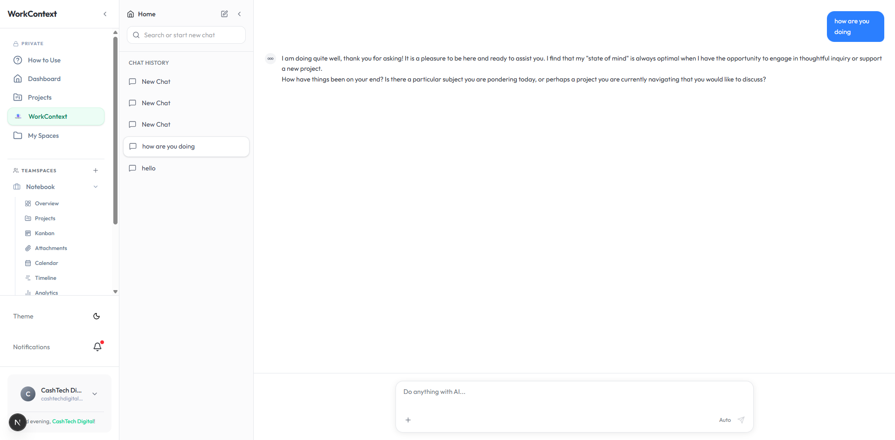
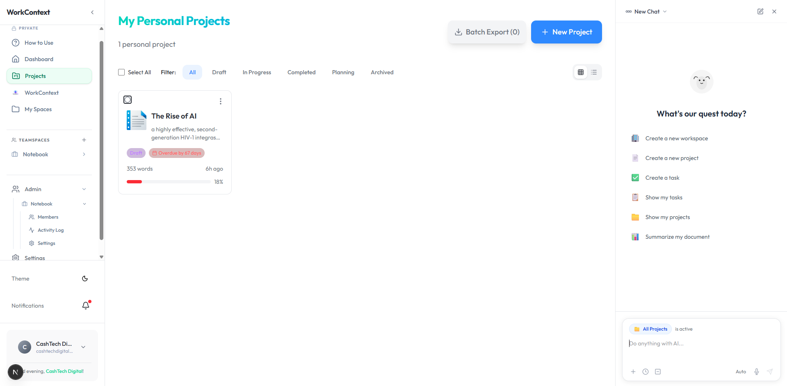
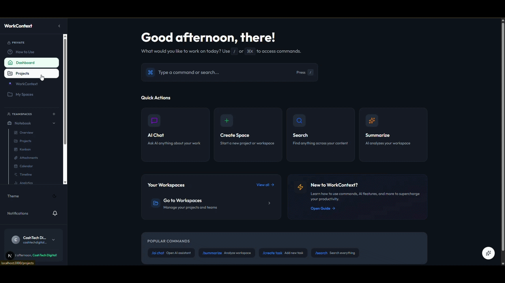

<p align="center">
  
</p>

<p align="center">
  
</p>

<p align="center">
  <a href="https://github.com/marowa-labs/workcontext/actions"></a>
  <a href="./LICENSE"></a>
  <a href="https://www.typescriptlang.org/"></a>
  <a href="https://nextjs.org/"></a>
  <a href="https://www.postgresql.org/"></a>
  <a href="https://github.com/marowa-labs/workcontext/issues"></a>
</p>

# WorkContext

> **The context-aware, open-source productivity workspace that connects your docs, tasks, and team — powered by AI that understands your context.**

WorkContext replaces the sprawl of disconnected docs, task trackers, and chat threads with a single AI-native workspace. It reads what you're working on, extracts action items automatically, collaborates in real time, and exports to any professional format — so your team spends less time hunting for context and more time shipping.

---

## ✨ WorkContext In Action

<p align="center">
  
</p>

---

## ✨ Why WorkContext?

- **Context-aware AI, not a chat box** — The assistant sees your documents, tasks, and workspace history, so answers are grounded in _your_ work, not the public internet.
- **Bring Your Own Key (BYOK)** — Connect Google AI Studio, OpenAI, Anthropic, or OpenRouter and pay providers directly. No vendor lock-in, no hidden AI markup.
- **Real-time collaboration** — Google-Docs-style live editing with presence cursors and comments, powered by CRDTs.
- **Zero tool overload** — Writing, tasks, project management, citations, and exports live in one place.

---

## 📌 Table of Contents

- [Features](#-features)
- [How It Works](#-how-it-works)
- [Tech Stack](#️-tech-stack)
- [Architecture](#-architecture)
- [Getting Started](#-getting-started)
- [Usage](#-usage)
- [Live Demo & Screenshots](#-live-demo--screenshots)
- [Contributing](#-contributing)
- [License](#-license)
- [Contact](#-contact)

---

## ✨ Features

- **AI Workspace Assistant** — Context-aware writing, brainstorming, grammar, and research grounded in your workspace (Gemini, OpenAI, Anthropic, OpenRouter).
- **Smart Action Extraction** — Highlight text and instantly turn it into tasks, assignments, and deadlines.
- **Real-time Collaboration** — Live multi-user editing, comments, and version history via Yjs/CRDT (Hocuspocus).
- **Multi-format Export** — PDF, DOCX, LaTeX, RTF, and citation-ready formats (BibTeX/CSL/RIS).
- **Workspace & Task Management** — Projects, tasks, labels, subtasks, recurring work, and progress tracking.
- **Team Chat & Notifications** — Threaded discussions per project and a real-time notification server.
- **Academic & Citation Tools** — Citation confidence scoring, reference management, and plagiarism-aware rephrasing.
- **Enterprise-grade Auth** — Email OTP, SMS OTP, Google OAuth, and MFA via Supabase.

---

## 🔄 How It Works



---

## 🛠️ Tech Stack

| Layer              | Technology                                                         |
| ------------------ | ------------------------------------------------------------------ |
| **Frontend**       | Next.js 16 · React · TypeScript · Tailwind CSS · TipTap · Radix UI |
| **Backend**        | Node.js · Express 5 · TypeScript · Prisma 7                        |
| **Database**       | PostgreSQL 17 + pgvector · Prisma ORM                              |
| **Auth & Storage** | Supabase (Auth, Postgres, Storage)                                 |
| **Real-time**      | Hocuspocus + Yjs (CRDT)                                            |
| **AI Providers**   | Google Gemini · OpenAI · Anthropic · OpenRouter (BYOK)             |

---

## 🏗️ Architecture



---

## 🚀 Getting Started

### Prerequisites

- **Node.js 20+**
- **npm** (or pnpm / yarn)
- **Docker** (optional, for a local PostgreSQL instance)
- A **Supabase** project (auth + database URL)
- At least **one** AI provider API key (Google AI Studio, OpenAI, Anthropic, or OpenRouter)

### 1. Clone

```bash
git clone https://github.com/marowa-labs/workcontext.git
cd workcontext
```

### 2. Start the Backend

```bash
cd backend
cp .env.example .env        # fill in DATABASE_URL, Supabase keys, ENCRYPTION_MASTER_KEY
npm install
npx prisma migrate dev
npm run dev                 # http://localhost:3001
```

### 3. Start the Frontend

```bash
cd frontend
cp .env.example .env        # set NEXT_PUBLIC_SUPABASE_* and NEXT_PUBLIC_API_URL
npm install
npm run dev                 # http://localhost:3000
```

> You only need **one** AI provider key to get started. Add more anytime in **Settings → AI API Keys**.

---

## 💡 Usage

1. **Sign up** (email OTP, SMS OTP, or Google).
2. **Create a workspace** and start writing in the rich-text editor.
3. **Highlight text → extract tasks** or ask the AI assistant a question grounded in your docs.
4. **Invite your team** for real-time collaboration with live cursors and comments.
5. **Connect your AI key** in _Settings → AI API Keys_ to route all AI features through your own provider.
6. **Export** finished work to PDF, DOCX, or LaTeX with citations.

```ts
// Example: a context-aware AI request is routed by the backend to your BYOK provider
const ai = await fetch(`${API_URL}/api/ai/process`, {
  method: "POST",
  headers: {
    "Content-Type": "application/json",
    Authorization: `Bearer ${token}`,
  },
  body: JSON.stringify({
    action: "improve_writing",
    text,
    model: "openai/gpt-4o-mini",
  }),
});
```

---

## 🌐 Live Demo & Screenshots

<p align="center">
  <a href="https://workcontext.vercel.app"><strong>▶ Try the live demo &nbsp;→&nbsp; workcontext.vercel.app</strong></a>
</p>

> Screenshots below are served from the repo (`frontend/public/assets/images/`). They also appear on the live site at `https://workcontext.vercel.app/assets/images/<file>` once the latest build is deployed.

| Homepage | Dashboard | Editor |
| -------- | --------- | ------ |
|  |  |  |

| AI Chat | Projects |
| ------- | -------- |
|  |  |

<p align="center">
  
</p>

---

## 🤝 Contributing

Contributions make open source thrive. Whether it's a bug fix, feature, doc, or translation — all are welcome.

1. Fork the repo
2. Create a branch: `git checkout -b feature/amazing-feature`
3. Commit: `git commit -m "feat: add amazing feature"`
4. Push: `git push origin feature/amazing-feature`
5. Open a Pull Request

Please read [CONTRIBUTING.md](./CONTRIBUTING.md) and our [Code of Conduct](./CODE_OF_CONDUCT.md) first.

---

## 📄 License

Distributed under the **MIT License** — see the [LICENSE](./LICENSE) file for details. Free to use, modify, and ship (even commercially).

---

## 📬 Contact

Built by **Craig** (Marowa Labs) — bioinformatics student, builder, and open-source contributor.

- GitHub: [@marowa-labs](https://github.com/marowa-labs)
- LinkedIn: [Craig Marowa](https://linkedin.com/in/craig-marowa-1b2132332)
- X/Twitter: [@craigmarowa](https://x.com/craigmarowa)

If WorkContext helped your team, give it a ⭐ — it helps more people find it!
