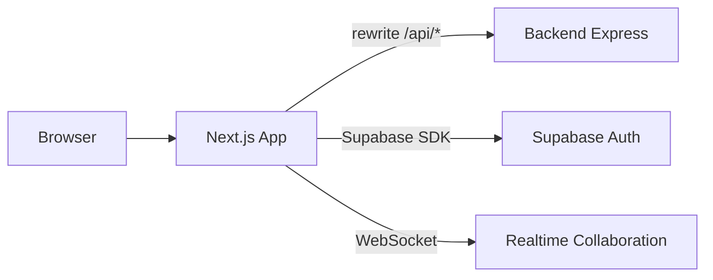

<p align="center">
  
</p>

<p align="center">
  <a href="https://nextjs.org/"></a>
  <a href="https://www.typescriptlang.org/"></a>
  <a href="https://tailwindcss.com/"></a>
  <a href="https://tiptap.dev/"></a>
  <a href="./LICENSE"></a>
</p>

# WorkContext — Frontend

> **The user-facing workspace: a blazing-fast Next.js app where docs, tasks, AI, and team collaboration come together in one context-aware interface.**

This package is the **frontend** of WorkContext. It renders the marketing site, the authenticated dashboard, the collaborative rich-text editor, and the AI settings UI. It talks to the [backend](../backend) over a typed API client and connects to Supabase for auth.

---

## 📌 Table of Contents

- [What's Inside](#-whats-inside)
- [Tech Stack](#️-tech-stack)
- [Project Structure](#-project-structure)
- [Getting Started](#-getting-started)
- [Environment](#-environment)
- [Scripts](#-scripts)
- [Deployment](#-deployment)
- [License](#-license)

---

## 🧩 What's Inside

- **Marketing site** — landing, pricing, solutions, integrations, security, changelog, blog, and docs.
- **Authenticated workspace** — dashboard, projects, tasks, spaces, billing, analytics, notifications.
- **Collaborative editor** — TipTap-based rich-text editing with real-time Yjs sync and presence.
- **AI settings** — Bring-Your-Own-Key UI for Google, OpenAI, Anthropic, and OpenRouter, with live model lists and connection tests.
- **Cross-platform UI** — Radix UI primitives + Tailwind, dark mode, and responsive layouts.

---

## 🛠️ Tech Stack

| Concern    | Technology                                     |
| ---------- | ---------------------------------------------- |
| Framework  | Next.js 16 (App Router) · React · TypeScript   |
| Styling    | Tailwind CSS · Radix UI · NextUI               |
| Editor     | TipTap 3 · Yjs (collaboration)                 |
| Auth       | Supabase Auth (`@supabase/ssr`)                |
| API Client | Fetch wrapper with bearer auth + retry/backoff |
| Realtime   | Hocuspocus provider (WebSocket)                |
| Analytics  | Vercel Analytics                               |

---

## 📁 Project Structure

```text
frontend/
├── app/
│   ├── (auth)/            # Login, signup, OTP
│   ├── (dashboard)/       # Protected app (ai, projects, tasks, settings, billing…)
│   ├── pages/
│   │   ├── dashboard/      # Feature pages (editor, settings, billing…)
│   │   └── marketing/      # Public site (home, pricing, blog, docs…)
│   ├── api/               # Next.js route handlers (proxy to backend)
│   └── components/        # Shared UI components
├── lib/                   # Utilities, supabase client, api client
├── public/                # Static assets
└── next.config.ts         # Rewrites /api → backend (same-origin in prod)
```



---

## 🚀 Getting Started

### Prerequisites

- Node.js 20+
- A running [WorkContext backend](../backend)
- Supabase project URL + anon key

### Install & Run

```bash
cd frontend
cp .env.example .env
npm install
npm run dev          # http://localhost:3000
```

---

## 🔐 Environment

Copy `.env.example` and set:

```env
NEXT_PUBLIC_SUPABASE_URL=https://your-project.supabase.co
NEXT_PUBLIC_SUPABASE_ANON_KEY=your_anon_key
NEXT_PUBLIC_API_URL=http://localhost:3001     # backend URL (or use the Vercel rewrite)
NEXT_PUBLIC_COLLABORATION_API_URL=ws://localhost:9081
```

> In production on Vercel, `/api/*` is rewritten to the backend, so CORS is not required for those calls — but direct `NEXT_PUBLIC_API_URL` calls are CORS-enabled on the backend for custom domains and preview deploys.

---

## 📜 Scripts

| Script          | Description                       |
| --------------- | --------------------------------- |
| `npm run dev`   | Start the dev server (hot reload) |
| `npm run build` | Production build                  |
| `npm run start` | Serve the production build        |
| `npm run lint`  | ESLint                            |

---

## 🚢 Deployment

Designed for **Vercel**. Connect the repo, set the `NEXT_PUBLIC_*` env vars, and deploy. The `next.config.ts` rewrite proxies `/api` to your backend (Render or any host), keeping requests same-origin.

---

## 📄 License

MIT — see the [root LICENSE](../LICENSE).
